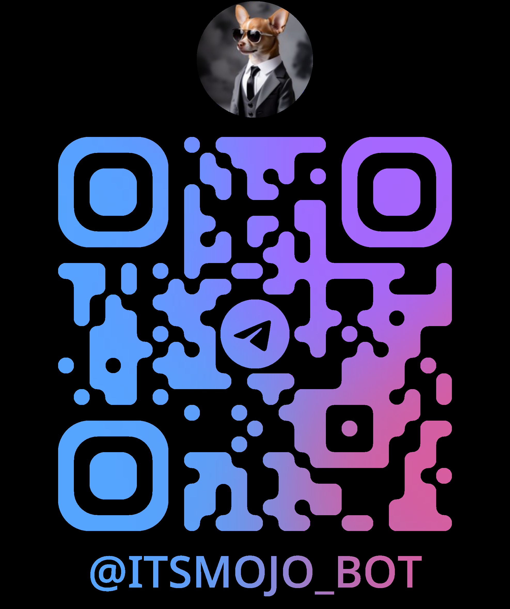

# 🎶 MOJO — Music Downloader Bot for Telegram 🎶

A simple bot for telegram to download music from Youtube

---

## 🛠️ Technologies:

- [Python 🐍](https://www.python.org/)
- [yt-dlp 📥](https://github.com/yt-dlp/yt-dlp)
- [python-telegram-bot 🤖](https://github.com/python-telegram-bot/python-telegram-bot)
- [dotenv 🔐](https://pypi.org/project/python-dotenv/)

---

## 🫳🏻 How to use:

#### 1️⃣ Scan the QrCode or search for @ItsMojo_Bot in Telegram:



### 2️⃣ Type /start to start bot and send

### 3️⃣ Send a youtube video link or music and artist name:

#### Example: Send [https://www.youtube.com/...](https://www.youtube.com/watch?v=60ItHLz5WEA&pp=ygURYWxhbiB3YWxrZXIgZmFkZWQ%3D) or Alan Walker - Faded

### 4️⃣ Download audio

---

## 🚀 How to run locally:

1️⃣ clone the project:

```bash
git clone https://github.com/romulomelendez/music-downloader-bot-telegram.git

cd music-downloader-bot-telegram
```

2️⃣ Install dependencies:

```bash
pip install -r requirements.txt
```

3️⃣ Create a .env file and set Telegram bot token:

```bash
TELEGRAM_BOT_TOKEN=your_token_here
```

4️⃣ Run bot:

```bash
python bot.py
```